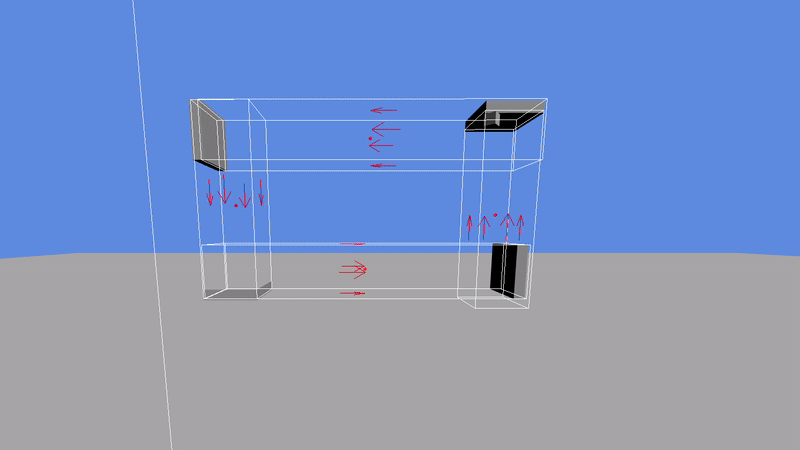
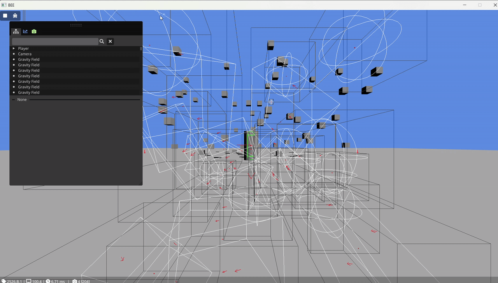
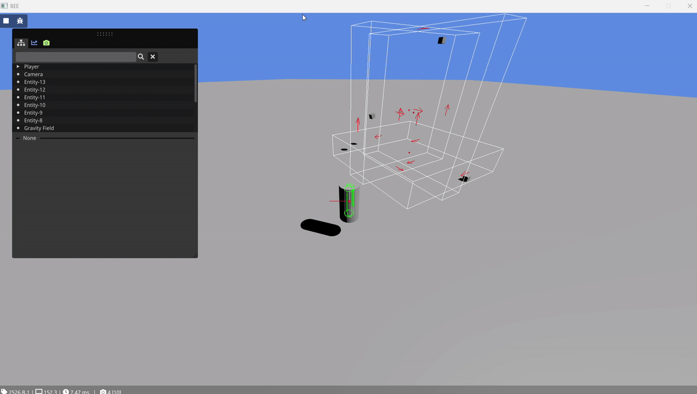

# Custom Gravity in Physics Environments



## Index(#custom-gravity-in-physics-environments)
- [Custom Gravity in Physics Environments](#custom-gravity-in-physics-environments)
  - [Index(#custom-gravity-in-physics-environments)](#indexcustom-gravity-in-physics-environments)
  - [Introduction](#introduction)
  - [Background](#background)
    - [Why are gravity fields interesting?](#why-are-gravity-fields-interesting)
    - [Prerequisite knowledge](#prerequisite-knowledge)
    - [Starting point](#starting-point)
    - [End product](#end-product)
  - [Implementation](#implementation)
    - [Representation](#representation)
    - [Collisions](#collisions)
    - [Priority](#priority)
  - [Analysis](#analysis)
    - [Trade-Offs](#trade-offs)
  - [Reflection](#reflection)
    - [Lessons learned](#lessons-learned)
    - [Future improvements](#future-improvements)
  - [References](#references)

## Introduction

Back when I was little, I used to play Super Mario Galaxy and its sequel on my Nintendo Wii. It was one of my favourite games back then.

As I learned more about gameprogramming and the technical sides of games, the inner workings of Super Mario Galaxy's systems fascinated me more and more. How did they do it? How did they create a movement system that worked so well with the game's strange gravity and camera angles?

In this article, I will discuss how I did it, the trade-offs that came with my solutions and possible improvements in the future.

<table>
<tr>
<td>Demo showing lots of gravity fields simulated at once</td>
<td>Demo showing moving gravity fields</td>
</tr>
</table>

## Background
### Why are gravity fields interesting?
I chose this project, because I wanted to learn more about how physics engines work and how I can work with them to create my own unique systems. It taught me about common design elements between different engines and what you can and cannot easily do with them.

Since physics engines are very common nowadays, being part of every major game engine, I think it is very valuable to take a look at how we can use them in a more unconventional way. This way we can see how we can change their default behaviours and change them for our own games.

### Prerequisite knowledge
This blog post assumes readers have basic knowledge about the following topics:
- The C++ programming language
- Entity Component Systems (ECS)
- Jolt Physics

### Starting point
For the purposes of this study project, I will be using the educational BEE engine provided by the BUaS teachers. BEE is an ECS based engine that has support for the Jolt Physics library. We will be using it because it already provides a 3D renderer, debug drawing and other useful debugging capabilities. Those aspects are not the focus of this research, so it is easier if they are already provided. 

For our research, we will mostly be using the Jolt integration of BEE.

### End product

At the end product of this article we will have met the following requirements for our gravity fields:
- Compatible with Jolt Physics rigid bodies.
- Usable in an ECS environment.
- Configurable strength and priority.

## Implementation

### Representation
The first thing we need to decide is how we want to represent our fields. We have two main options for this. Either we decide to define the fields ourselves and not add them to the Jolt Physics world or we define the fields as sensor objects in Jolt Physics.

The first option is to define the fields ourselves. This way we have complete control over the field's position and rotation and eliminates the need to synchronise the position and rotation between the positions of the bodies in Jolt and BEE's Transform component. To query collisions, we can use the `CollideShape()` function of the `NarrowPhaseQuery` class in Jolt. It also means all the data for our fields can be stored nice and concise in a single component.

The second option is to use sensors. Sensors function like trigger volumes. They are objects that Jolt doesn't give any collision response to and it is up to us to define what they do when hit. The advantage here is that we don't have to query Jolt manually every frame. Instead we can use the systems built into Jolt to query the collisions, such as the `ContactListener` class or the `WereBodiesInContact()` function, and take advantage of the fact that Jolt caches collisions for bodies added to its physics world. The main drawback is that we now do have to synchronise between BEE's transform and the positions of the bodies in Jolt. We can store an ID to this sensor in a component, together with the rest of the required data (i.e. strength and priority).

In my implementation, I chose the sensors. In BEE's existing integration of Jolt Physics there already is a system that can synchronise between Jolt and its own Transform components. I can borrow this system and adapt it to also work for my fields. If you are also using a physics engine, chances are you also already have a function like this for the normal rigid bodies. In this case, creation of a simple planar gravity field looks like this:

```cpp
// Definition of component
struct GravityField
{
	enum Type
	{
		Plane,
		Sphere
	};

	float m_strength = 100.0f;
	unsigned int priority = 0;
	unsigned int m_sensorid = 0;
	Type type = Plane;
};

// Helper function for creating a field
Entity CreatePlaneGravityField(glm::vec3 position, glm::quat rotation, glm::vec2 area, float range, float strength, unsigned int priority, bool isStatic)
{
	Entity entity = Engine.ECS().CreateEntity();

	// Make sure the entity has a transform
	auto& transform = Engine.ECS().CreateComponent<Transform>(entity);
	transform.SetTranslation(position);
	transform.SetRotation(rotation);
	transform.Name = "Gravity Field";

	// make sure the entity has the gravity field component
	auto& field = Engine.ECS().CreateComponent<GravityField>(entity);
	field.m_strength = strength;
	field.priority = priority;
	field.type = GravityField::Plane;

	BodyInterface& interface = JoltSystem::GetInternalSystem()->GetBodyInterface();

	BoxShapeSettings shapesettings(ToJolt<Vec3>(glm::vec3(area.x, range, area.y)));
	BoxShapeSettings::ShapeResult result = shapesettings.Create();
	ShapeRefC shape = result.Get();

	BodyCreationSettings settings(shape,
								  ToJolt<RVec3Arg>(position),
								  ToJolt(rotation),
								  isStatic ? EMotionType::Static : EMotionType::Kinematic,
								  JoltLayers::NON_MOVING);

	settings.mIsSensor = true;

	BodyID id = interface.CreateAndAddBody(settings, EActivation::Activate);
	
	if(id.IsInvalid())
	{
		Log::Error("Could not create body for gravity field");
		Engine.ECS().DeleteEntity(entity);
		return entt::null;
	}

	field.m_sensorid = id.GetIndexAndSequenceNumber();

	return entity;
}
```

### Collisions

Now that we've decided to use sensors for our gravity fields, the next question arises. How do we query and use the collisions reported by Jolt? There are numerous options here, none of them perfect.

The first option I want to highlight is the `WereBodiesInContact()` function in the `PhysicsSystem` class. We can feed this function two BodyID's and it will simply return a boolean value, telling us whether the bodies were in contact during the last physics frame. This is by far the easiest method of querying collisions with sensors, but also the least versatile. It requires a nested loop over all the fields and all the normal bodies to check contacts with each of them and act accordingly.

Another option is the aforementioned `ContactListener` class. This class allows us to override its `OnContactAdded()` and `OnContactRemoved()` functions. This is a bit more tricky to implement, though nothing too bad. Since this approach is event based and nothing is stored by Jolt between calls, it requires us to keep our own list of active collisions, which we can update using those 2 functions. We can then create a system to loop over this list and apply the gravity.

Once again, I went with the second option. It allows us to cache collisions and removes the need of unnecessary collision checks. The more complicated implementation is something our users don't need to know and should be abstracted away. This implementation also greatly helps with our priorities, which I'll explain further in the next section.

### Priority

The final major roadblock are the priorities. In my goals for this feature, I mentioned that the fields should be able to have priorities set and fields should be able to override other fields. This helps designers create more complex levels without fields interfering with eachother unwantedly.

The simplest solution that comes to mind is to update our loop for applying gravity. In there we can store the highest priority field we've encountered so far. If we encounter a lower priority, we can skip it. If we find a higher priority, we can discard all of the gravity forces we've calculated so far. However, this doesn't seem very efficient, does it? This way we always loop over all of the fields, even though we may not even need them.

We can improve this solution, by making clever use of the `ContactListener` we used before. In the callback, instead of just adding the collisions to the list in arbitrary order, we can sort the collisions there, based on the priorities of the gravity fields, with the highest coming first. This way we can simplify the loop for applying gravity. Instead of looping over everything, we can simply loop from the beginning, until we find a priority lower than the first and discard the rest. Now we are never calculating gravities that we won't use.

## Analysis

### Trade-Offs
First off, this project is highly focused on an ECS environment. The choices made here are made with those considerations in mind. This makes it difficult to port the project to games or engines that are more object oriented in their architecture.

Secondly, this project is also very much based on Jolt Physics and its way of querying collisions and using sensors. Depending on how similar to Jolt they are, it might be pretty difficult to use these algorithms on other physics engines.

Lastly, I wanted to focus on regular dynamic rigid bodies for this blog post. Getting the fields to work on other types of objects (i.e. kinematic bodies, player characters) will require some more work.

## Reflection

### Lessons learned

This project has taught me a lot about physics engines. I have researched different physics engines and their API's. I have learned about common elements between them as well as the many differences they have.

This project also involved quite a bit of rotation math, mainly quaternions. Quaternions are very intimidating when you first see them. When you get to know them a bit better, they are not so bad.

### Future improvements

The first thing that comes to mind as a next step to add to this system is support for more body types. How would this system look for player characters and cameras?

Another improvement could be to make the system more general, so it can work with multiple physics engines and make it more generally usable.

## References
- [Jolt Physics Documentation](https://jrouwe.github.io/JoltPhysics/index.html)
- ['How Spherical Planets Bent the Rules in Super Mario Galaxy' by Jasper on YouTube](https://www.youtube.com/watch?v=QLH_0T_xv3I)